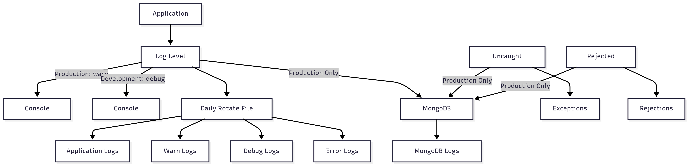

# README_Log - Système de Logging Winston

## Vue d'ensemble


Ce module implémente un système de logging robuste et professionnel basé sur Winston, conçu pour gérer efficacement les logs dans différents environnements (développement/production) avec des stratégies de stockage multiples.

## Architecture

### Structure des transports

```bash
Application (user-service)
├── Console Transport (temps réel)
├── File Transports (rotation quotidienne)
│   ├── application.log (info+, 14 jours)
│   ├── errors.log (error, 30 jours)
│   ├── warns.log (warn, 21 jours)
│   └── debugs.log (debug, 21 jours)
├── MongoDB Transport (production uniquement)
└── Exception Handlers
    ├── exceptions.log (erreurs non capturées)
    └── rejections.log (promesses rejetées)
```

## Installation

### Dépendances requises

```bash
npm install winston winston-daily-rotate-file winston-mongodb
```

### Variables d'environnement

```env
NODE_ENV=development|production
DATABASE_URL=mongodb://localhost:27017/your-database
```

## Utilisation

### Import du logger

```javascript
import log from './path/to/logger';
```

### Exemples d'utilisation

#### Logging basique

```javascript
// Logs d'information
log.info('Utilisateur connecté', { userId: 123, ip: '192.168.1.1' });

// Logs d'avertissement
log.warn('Tentative de connexion échouée', { 
  email: 'user@example.com', 
  attempts: 3 
});

// Logs d'erreur
log.error('Erreur de base de données', { 
  error: error.message, 
  stack: error.stack,
  query: 'SELECT * FROM users' 
});

// Logs de debug (développement uniquement)
log.debug('Paramètres de requête', { params: req.params });
```

#### Logging avec métadonnées

```javascript
// Utilisation de métadonnées enrichies
log.info('Transaction effectuée', {
  transactionId: 'tx_123456',
  userId: 456,
  amount: 99.99,
  currency: 'EUR',
  timestamp: new Date().toISOString()
});
```

#### Gestion d'erreurs avec contexte

```javascript
try {
  // Code métier
  await processPayment(paymentData);
} catch (error) {
  log.error('Échec du traitement de paiement', {
    error: error.message,
    stack: error.stack,
    paymentId: paymentData.id,
    userId: paymentData.userId,
    context: 'payment-processing'
  });
  throw error;
}
```

## Configuration

### Niveaux de log

| Niveau | Développement | Production | Description |
|--------|---------------|------------|-------------|
| `error` | ✅ | ✅ | Erreurs critiques |
| `warn` | ✅ | ✅ | Avertissements |
| `info` | ✅ | ✅ | Informations générales |
| `debug` | ✅ | ❌ | Debug (dev uniquement) |

### Formats de sortie

#### Développement

```bash
2024-01-15 10:30:45 [info]: Utilisateur connecté {"userId": 123}
```

#### Production

```json
{
  "timestamp": "2024-01-15T10:30:45.123Z",
  "level": "info",
  "message": "Utilisateur connecté",
  "userId": 123,
  "service": "user-service"
}
```

## Gestion des fichiers

### Rotation quotidienne

- **Pattern** : `YYYY-MM-DD` (ex: `application-2024-01-15.log`)
- **Taille max** : 30MB par fichier
- **Compression** : Archive ZIP des anciens fichiers
- **Rétention** :
  - Application générale : 14 jours
  - Warnings/Debug : 21 jours
  - Erreurs : 30 jours

### Structure des répertoires

```bash
logs/
├── application-2024-01-15.log
├── errors-2024-01-15.log
├── warns-2024-01-15.log
├── debugs-2024-01-15.log
├── exceptions.log
├── rejections.log
└── archives/
    ├── application-2024-01-14.log.gz
    └── errors-2024-01-14.log.gz
```

## MongoDB (Production)

### Configuration-Logs

- **Collection** : `Log` (capped collection)
- **Taille max** : 20MB
- **Documents max** : 1500
- **Pool de connexions** : 200
- **Reconnexion automatique** : Activée

### Structure des documents

```javascript
{
  "_id": ObjectId("..."),
  "timestamp": "2024-01-15T10:30:45.123Z",
  "level": "info",
  "message": "Utilisateur connecté",
  "meta": {
    "userId": 123,
    "service": "user-service"
  }
}
```

## Gestion des exceptions

### Exceptions non capturées

Les erreurs non gérées sont automatiquement capturées et sauvegardées dans :

- `logs/exceptions.log`
- MongoDB (en production)

### Promesses rejetées

Les promesses rejetées non gérées sont capturées dans :

- `logs/rejections.log`
- MongoDB (en production)

## Monitoring et alertes

### Recommandations

1. **Surveillez les fichiers d'exceptions** pour détecter les erreurs critiques
2. **Configurez des alertes** sur les logs d'erreur MongoDB
3. **Analysez régulièrement** les patterns dans les logs d'avertissement
4. **Purgez périodiquement** les anciens fichiers de logs

### Métriques importantes

- Nombre d'erreurs par heure
- Taux de warnings
- Taille des fichiers de logs
- Utilisation de l'espace disque

## Customisation

### Ajouter un nouveau transport

```javascript
const customTransport = new winston.transports.File({
  filename: 'logs/custom.log',
  level: 'info',
  format: winston.format.json()
});

// Ajouter au logger existant
log.add(customTransport);
```

### Modifier le format

```javascript
const customFormat = winston.format.combine(
  winston.format.timestamp(),
  winston.format.printf(({ timestamp, level, message, ...meta }) => {
    return `[${timestamp}] ${level.toUpperCase()}: ${message} ${JSON.stringify(meta)}`;
  })
);
```

## Dépannage

### Problèmes courants

#### Permissions de fichiers

```bash
# Vérifier les permissions du dossier logs
ls -la logs/
# Corriger si nécessaire
chmod 755 logs/
```

#### Connexion MongoDB

```javascript
// Vérifier la connexion
log.info('Test de connexion MongoDB');
// Vérifier les logs pour les erreurs de connexion
```

#### Rotation des fichiers bloquée

```bash
# Vérifier l'espace disque
df -h
# Nettoyer les anciens fichiers si nécessaire
find logs/ -name "*.log.gz" -mtime +30 -delete
```

## Performances

### Optimisations

- **Pool de connexions MongoDB** : 200 connexions simultanées
- **Collection capped** : Évite la croissance incontrôlée
- **Rotation quotidienne** : Maintient des fichiers de taille raisonnable
- **Compression** : Réduit l'espace disque utilisé

### Recommandations d'usage

- Évitez les logs trop verbeux en production
- Utilisez des métadonnées structurées plutôt que des messages longs
- Implémentez une stratégie de rétention adaptée à vos besoins

## Sécurité

### Bonnes pratiques

- **Ne loggez jamais** :
  - Mots de passe
  - Tokens d'authentification
  - Données personnelles sensibles
  - Clés API

### Exemple de logging sécurisé

```javascript
// Mauvais
log.info('Connexion utilisateur', { password: 'secret123' });

// Bon
log.info('Connexion utilisateur', { 
  userId: user.id, 
  email: user.email.replace(/(.{2}).*(@.*)/, '$1***$2') 
});
```

## Ressources supplémentaires

- [Documentation Winston](https://github.com/winstonjs/winston)
- [Winston Daily Rotate File](https://github.com/winstonjs/winston-daily-rotate-file)
- [Winston MongoDB](https://github.com/winstonjs/winston-mongodb)

## Contribution

Pour contribuer à l'amélioration du système de logging :

1. Suivez les conventions de nommage
2. Documentez les nouvelles fonctionnalités
3. Testez en environnement de développement
4. Validez les performances en production

---

**Version** : 1.0.0  
**Dernière mise à jour** : Janvier 2024  
**Mainteneur** : Équipe DevOps
